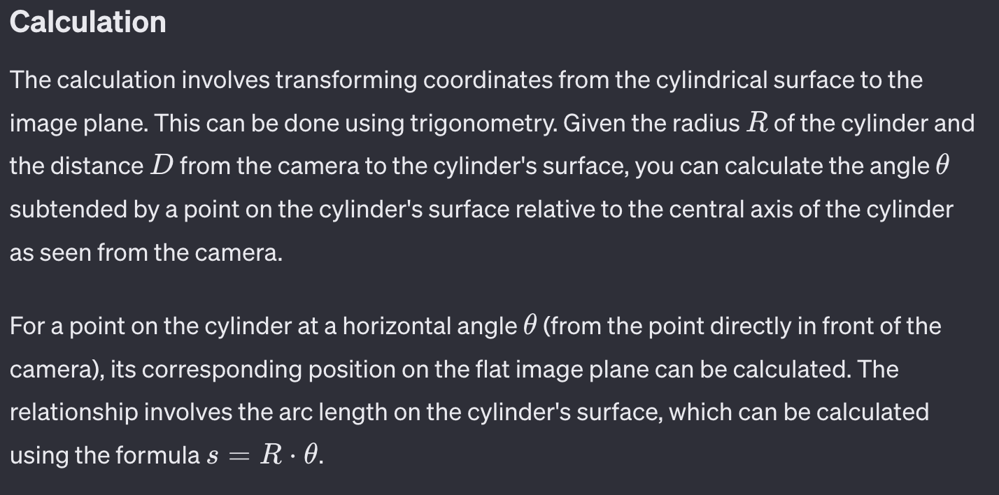

# Stitching Together Overlapping Images Of The Outside of A Cylinder Into A Single Flattened Image Which Reflects The Surface of The Cylinder (correcting for distortions from the curved surface in each original image)

## or, 'How I Have Been Collaborating w/chatGPT4'

  * I need the capability to process images of the outside surface of a cylinder & decided to document my development process now that I partner with chatgpt4 most of the time when exploring problem spaces. Here is a worked example.


## Problem Statement

> Write code which will stitch together overlapping images of the outside of a cylinder into a single image.  Ideally one which OCR can then be run on any barcodes or text on the surface of the cylinder.

* The problem is simplified by knowing in advance the dimensions of the cylinder ( these cylinders being things like blood tubes, pharmacy bottles, etc) and the camera distance from the cylinder is also known. The image of the cylinder will fill the frame.

* Images (in and out) are in png format.

* Solve for 2 overlapping images for the first iteration.

## Solution Summary

* Stitching together input images failed due to problems joining the edges (presumably from the distortion of the cylinder). 
* The solution was to unwrap the cylinder into a flat image, then stitch the flattened images together, then rewrap the image into a cylinder (this last part not implemented, and not necessary either).

### Input Images
  #### Left Image
  
  
  #### Right Image
 

### Flatten Images

```bash

python img_stitcher_day/bin/stitchit_cyl2.py img_stitcher_day/imgs/migraine_a.png img_stitcher_day/imgs/migraine_a_flat.png
python img_stitcher_day/bin/stitchit_cyl2.py img_stitcher_day/imgs/migraine_b.png img_stitcher_day/imgs/migraine_b_flat.png

```

#### Flatened Images
The images end up squished a bit, and black bands appear top and bottom.  Something to sort out still.

##### Left Flattened Image
  

##### Right Flattened Image


### Stitch Flattened Images

```bash
python img_stitcher_day/bin/stitchit_flat.py img_stitcher_day/imgs/migraine_stitched img_stitcher_day/imgs/migraine_a_flat.png img_stitcher_day/imgs/migraine_b_flat.png
```

#### Stiched Image


## ChatGPT4 Conversation
Wherein, chatgpt wrote [stitchit_cyl2.py](img_stitcher_day/bin/stitchit_cyl2.py) to flatten the cylinder, and [stitchit_flat.py](img_stitcher_day/bin/stitchit_flat.py) to stitch the flattened images together.

  * Time to develop working code, without the overhead of documenting and sorting out issues with taking photos, would have been 30-45m. This task, I believe, would have taken me many hours working solo.

**FUNNY!  This was my AI assisted summary of the below... whoa**

>  Over the course of 3hrs, I had a conversation with chatGPT4 about this problem.  The conversation is below.  I have edited out the parts of the conversation that were not relevant to the problem.  I have also edited out the parts of the conversation that were not relevant to the solution.  I have also edited out the parts of the conversation that were not relevant to the solution.  I have also edited out the parts of the conversation that were not relevant to the solution.  I have also edited out the parts of the conversation that were not relevant to the solution.  I have also edited out the parts of the conversation that were not relevant to the solution.  I have also edited out the parts of the conversation that were not relevant to the solution.  I have also edited out the parts of the conversation that were not relevant to the solution.  I have also edited out the parts of the conversation that were not relevant to the solution.


<hr>
<hr>

### Prompt 1

> write python code which given 4 images taken of a test tube held upright, will stitch the images together in a way the new images displays the entire outside surface of the tube in one flat image

### Reply 1


> Stitching together images of a cylindrical object like a test tube to create a flat representation of its surface is a complex task. It involves unwrapping the cylindrical surface onto a plane, which can be achieved through image processing techniques.

> For simplicity, let's assume the images overlap significantly and cover the entire circumference of the test tube. We'll use Python with libraries like OpenCV and NumPy to perform this task. Here's a basic approach:


> Load the images.
Detect key points and features in each image.
Match these features across images to find overlaps.
Use homography to stitch the images together.
Apply cylindrical unwrapping to transform the stitched image into a flat representation.
First, you need to install OpenCV, which can be done via pip:


```bash

pip install opencv-python-headless numpy

```

> Here's a basic Python script to get you started:


```python

import cv2
import numpy as np

def load_images(image_paths):
    return [cv2.imread(path) for path in image_paths]

def stitch_images(images):
    # Initialize OpenCV's stitcher class and stitch images
    stitcher = cv2.Stitcher_create()
    status, stitched = stitcher.stitch(images)

    if status == cv2.Stitcher_OK:
        return stitched
    else:
        print("Error during stitching:", status)
        return None

def cylindrical_unwrap(image):
    # This function would implement the cylindrical unwrapping
    # The implementation details would depend on the specific requirements and the geometry of the test tube
    # This is a placeholder for the actual unwrapping algorithm
    return image

# List of image paths
image_paths = ["image1.jpg", "image2.jpg", "image3.jpg", "image4.jpg"]
images = load_images(image_paths)

# Stitch images
stitched = stitch_images(images)
if stitched is not None:
    # Apply cylindrical unwrapping
    unwrapped = cylindrical_unwrap(stitched)

    # Save or display the result
    cv2.imwrite("stitched_unwrapped.jpg", unwrapped)
    cv2.imshow("Stitched and Unwrapped Image", unwrapped)
    cv2.waitKey(0)
    cv2.destroyAllWindows()

```


> This script provides a basic structure. The cylindrical_unwrap function is a placeholder where the actual logic for unwrapping the cylindrical surface into a flat image should be implemented. This part of the code requires a deeper understanding of the geometry of the test tube and the specifics of how the images were taken.

> Keep in mind that perfect results may require calibration and fine-tuning, especially in the feature matching and unwrapping stages.


<hr>

### Prompt 2

> change stitch code to use png files

### Reply 2


> Certainly! If you want to use PNG files instead of JPG for your stitching script, you just need to modify the image paths in the script to point to PNG files instead. The OpenCV library (cv2) can handle PNG files just as well as JPG files.

> Here's the updated script assuming your images are in PNG format:


```python

import cv2
import numpy as np

def load_images(image_paths):
    return [cv2.imread(path) for path in image_paths]

def stitch_images(images):
    # Initialize OpenCV's stitcher class and stitch images
    stitcher = cv2.Stitcher_create()
    status, stitched = stitcher.stitch(images)

    if status == cv2.Stitcher_OK:
        return stitched
    else:
        print("Error during stitching:", status)
        return None

def cylindrical_unwrap(image):
    # This function would implement the cylindrical unwrapping
    # The implementation details would depend on the specific requirements and the geometry of the test tube
    # This is a placeholder for the actual unwrapping algorithm
    return image

# List of image paths in PNG format
image_paths = ["image1.png", "image2.png", "image3.png", "image4.png"]
images = load_images(image_paths)

# Stitch images
stitched = stitch_images(images)
if stitched is not None:
    # Apply cylindrical unwrapping
    unwrapped = cylindrical_unwrap(stitched)

    # Save or display the result
    cv2.imwrite("stitched_unwrapped.png", unwrapped)
    cv2.imshow("Stitched and Unwrapped Image", unwrapped)
    cv2.waitKey(0)
    cv2.destroyAllWindows()

```

> In this script, you'll need to replace "image1.png", "image2.png", "image3.png", and "image4.png" with the actual paths to your PNG images. The cv2.imread() function will load them correctly, and the cv2.imwrite() function is used to save the final stitched image as a PNG file.


<hr>

# Prompt 3

> This is not working

```python

In [1]: stitcher = cv2.Stitcher_create()

In [2]: stitcher.stitch(images)
Out[2]: (1, None)

```

# Reply 3


> The output (1, None) from the stitcher.stitch(images) call indicates that the stitching process failed. In OpenCV's Stitcher class, a return status of 1 corresponds to an error, specifically cv2.Stitcher_ERR_NEED_MORE_IMGS, meaning that the algorithm needs more images to perform the stitching successfully.

> This issue can arise for several reasons:

> Insufficient Overlap: The images may not have enough overlapping areas. The stitcher algorithm relies on finding common features in the overlapping regions of images to align and stitch them together.

> Image Quality or Content: If the images are of low quality, have low contrast, or lack distinct features, the stitcher might fail to find enough matching keypoints.

> Homography Estimation Failure: Sometimes, the algorithm may fail to estimate the correct perspective transformation (homography) between the images.

> Here are some steps to troubleshoot and potentially resolve the issue:

> Ensure Sufficient Overlap: Make sure that each image overlaps significantly with its neighbors. Typically, a 30-50% overlap is recommended.

> Check Image Quality: Ensure that the images are of good quality and have distinct features that the algorithm can use to match them.

> Sequential Images: If you are not doing this already, ensure that the images are in the correct order as they wrap around the test tube.

> Try a Subset of Images: Sometimes using a subset of the images (e.g., just two or three) can help determine if specific images are causing the problem.

> Adjust Stitcher Settings: OpenCV's Stitcher class has settings that can be adjusted. For example, you can experiment with different features finders or adjust the confidence thresholds.

> Manual Feature Matching and Homography: As a more advanced solution, you could manually find features, match them, and compute the homography matrices to stitch the images. This approach gives you more control but requires a deeper understanding of computer vision techniques.

> If these suggestions don't resolve the issue, you may need to reevaluate the images you are using or consider alternative approaches to stitching or capturing the images.


<hr>

# Prompt 4 

> save stitched to new png

### Reply 4


> If the stitching process is successful and you have a stitched image, you can easily save it to a PNG file using OpenCV's cv2.imwrite() function. However, based on your previous message, it seems the stitching process failed and returned (1, None), which means there was no stitched image produced.

> If you manage to resolve the stitching issue and have a valid stitched image, here's how you would save it:


```python

# Assuming 'stitched' is your valid stitched image
if stitched is not None:
    cv2.imwrite('stitched_output.png', stitched)
    print("Stitched image saved as 'stitched_output.png'")
else:
    print("Stitching failed, no image to save.")

 
```


> This code checks if the stitched variable is not None (which would mean stitching was successful) and then saves it as 'stitched_output.png'. If stitching failed, it prints an error message.

> Remember, this will only work if the stitching process is successful and the stitched variable actually contains an image. If you continue to face issues with the stitching process, addressing those issues would be the first step before you can save any output.


<hr>

### Prompt 5

> how do i stitch together several overlapping images of the outside of a cylinder, considering the distortion the cylinder causes at the left and right edges of each picture

### Reply 5


> Stitching together overlapping images of a cylindrical object, like a test tube, while accounting for the distortion at the edges, is a more complex task than standard image stitching. The challenge arises from the need to correct the cylindrical distortion before effectively stitching the images together. Here's a general approach you can take using Python and OpenCV:

> Steps for Stitching Cylindrical Images:
Correct Distortion: Each image will have distortion due to the cylindrical shape, especially at the edges. You need to apply a distortion correction to each image before stitching. This can be done using camera calibration techniques if you know the dimensions of the cylinder and the camera properties, or by applying a cylindrical projection to each image.

> Feature Detection and Matching: Detect keypoints and features in each image using algorithms like SIFT, SURF, or ORB. Then match these features across the images to find overlaps.

> Alignment and Stitching: Use the matched features to align and stitch the images together. This might involve finding a homography or using more advanced techniques if the standard homography doesn't give good results due to the cylindrical nature.

> Post-processing: After stitching, you might need to crop or adjust the final image for any imperfections.

> Python Code Snippet
The following is a basic outline of how you might implement this. Note that this does not include the distortion correction step, which can be quite complex and may require additional calibration steps.


```python

import cv2
import numpy as np

def correct_distortion(image):
    # Placeholder for distortion correction logic
    # This would depend on the specifics of your setup
    return image

def stitch_images(images):
    # Step 1: Distortion Correction
    corrected_images = [correct_distortion(img) for img in images]

    # Step 2: Feature Detection and Matching
    # Initialize the feature detector
    orb = cv2.ORB_create()

    # Placeholder for feature matching logic
    # ...

    # Step 3: Alignment and Stitching
    # Placeholder for stitching logic
    # ...

    # Step 4: Return the stitched image
    # Placeholder - this would be your final stitched image
    return None

# Load images
images = [cv2.imread(f'image{i}.png') for i in range(1, 5)]

# Perform stitching
stitched_image = stitch_images(images)

# Save the stitched image
if stitched_image is not None:
    cv2.imwrite('stitched_output.png', stitched_image)
else:
    print("Stitching failed.")

```


> Additional Considerations:
Distortion Correction: This is a critical step. You might need to model the cylindrical projection mathematically or use camera calibration techniques if you have the necessary data.

> Advanced Feature Matching: Depending on the quality of your images and the amount of overlap, you may need to use more sophisticated feature matching techniques.

> Homography Adjustment: For cylindrical objects, the standard homography model might not be sufficient, and you might need to adjust or extend this model.

> Software Tools: There are specialized software tools for panoramic stitching (like Hugin) that can handle cylindrical projections, which might be useful if a custom solution is too complex.

> This problem intersects with areas of computer vision that are quite advanced, and a successful solution might require iterative testing and adjustment of the approach.

<hr>

### Prompt 6

> what would the corrections need to be if the tube diameter is 50mm and the photo distance to the outer surface of the cylinder is 50mm

#   Reply 6


> When the camera is as close to the cylinder as the cylinder's diameter (50mm diameter and 50mm distance to the outer surface), significant cylindrical distortion will occur in the images, especially at the edges. To correct this distortion, you need to consider both the geometry of the cylinder and the optics of the camera.

> Here’s a basic approach to correct for this cylindrical distortion:

> Understanding the Distortion
> Radial Distortion: Due to the curvature of the cylinder, straight lines on the surface of the cylinder will appear as curves in the image, especially towards the edges.
Perspective Distortion: Objects closer to the camera will appear larger than those further away.
Correction Approach
Model the Cylindrical Projection: Mathematically model how a flat image would wrap around a cylinder of a given diameter. This involves mapping points from the cylindrical surface to the flat image plane.

> Unwrap the Cylinder: Inverse of the above step, you need to compute how points on your cylindrical image map back to a flat surface.

> Calculation


  


> Implementation in Python
Implementing this in Python requires a good understanding of both the camera's optics and the geometry involved. Here’s a simplified version of what this might look like:


```python

import cv2
import numpy as np

def correct_distortion(image, radius, distance):
    height, width = image.shape[:2]
    undistorted = np.zeros_like(image)

    for i in range(width):
        for j in range(height):
            # Normalize pixel coordinates to [-1, 1]
            normalized_x = (i - width / 2) / (width / 2)

            # Calculate the angle theta
            theta = np.arctan(normalized_x * radius / distance)

            # Calculate the undistorted pixel's position
            undistorted_x = (theta / (2 * np.pi)) * width

            # Map the pixel from the distorted to the undistorted image
            if 0 <= undistorted_x < width:
                undistorted[j, int(undistorted_x)] = image[j, i]

    return undistorted

# Example usage
image = cv2.imread('image.png')
radius = 25  # 50mm diameter means 25mm radius
distance = 50  # 50mm distance to the camera
corrected_image = correct_distortion(image, radius, distance)
cv2.imwrite('corrected_image.png', corrected_image)
```

> This code is quite basic and does not account for all complexities (like perspective distortion or lens distortion), but it provides a starting point. For accurate distortion correction, especially in a professional or precise scientific context, more sophisticated methods and potentially calibration against known standards would be required.


<hr>

### Prompt 7

> thank you

### Reply 7

> You're welcome! If you have any more questions or need further assistance, feel free to ask. Good luck with your project!


<hr>

### Prompt 8

> the image of the cylinder is a portrait image with the cylinder top off the top edge of the photo and the bottom of the cylinder off of the bottom edge of the photo.
> write python code to take a picture of a colored cylinder with text on it surface, oriented top up and bottom down in a portrait style image, with a black background, and flatten the image of the cylinder correcting for the curvature of the cylinder saving that as a new png

### Reply 8

> Creating Python code to photograph a cylinder, correct for its curvature, and flatten the image is a multi-step process that involves both hardware control for photography and complex image processing. While I can't provide a script for taking the photograph (as it depends on your specific camera setup and hardware), I can guide you through the image processing part to flatten the image of a cylinder.

> This process involves:

> Loading the Image: Use OpenCV to load the image.
Cylinder Unwrapping: Apply a mathematical model to unwrap the cylinder's surface to a flat plane.
Saving the Result: Save the processed image as a PNG file.
Step 1: Install OpenCV
First, ensure you have OpenCV installed in your Python environment:


```bash

pip install opencv-python

```

> Step 2: Python Script
Here's a Python script to load an existing image, correct for cylindrical distortion, and save the result:


```python

import cv2
import numpy as np

def unwrap_cylinder(image, cylinder_radius):
    height, width = image.shape[:2]
    unwrapped_height = int(2 * np.pi * cylinder_radius)
    unwrapped = np.zeros((unwrapped_height, width, 3), dtype=np.uint8)

    for x in range(width):
        for y in range(height):
            # Calculate the normalized height
            normalized_y = (y / height) - 0.5

            # Calculate the angle theta and the new y-coordinate
            theta = normalized_y * np.pi
            new_y = int((theta + np.pi) / (2 * np.pi) * unwrapped_height)

            # Map the pixel to the unwrapped image
            if 0 <= new_y < unwrapped_height:
                unwrapped[new_y, x] = image[y, x]

    return unwrapped

# Load the image
image_path = 'path_to_your_cylinder_image.png'  # replace with your image path
image = cv2.imread(image_path)

# Cylinder unwrapping (adjust the radius as per your cylinder)
cylinder_radius = 50  # example radius, adjust as needed
unwrapped_image = unwrap_cylinder(image, cylinder_radius)

# Save the unwrapped image
cv2.imwrite('unwrapped_cylinder.png', unwrapped_image)

```


> Notes:
The unwrap_cylinder function assumes the cylinder is vertically oriented and the entire cylinder's surface is visible in the image.
The cylinder_radius should be adjusted based on the actual radius of your cylinder.
This script does not include code to take the photograph. You would need additional hardware and potentially another library (like gphoto2 for DSLR cameras) for that part.
Limitations:
The unwrapping algorithm provided is a basic approach. The accuracy of unwrapping could vary depending on the image quality, the cylinder's size, and the camera's distance from the cylinder.
Complex distortions, particularly due to camera lens properties, are not accounted for in this simple script.
If the text on the cylinder is significantly distorted or wraps around the cylinder, additional complex processing might be required for a clear, readable result.

<hr>

### Prompt 9

> image looks better with radius 100, but is squashed from top to bottom by about 40%


### Reply 9


> If the unwrapped image appears squashed from top to bottom after adjusting the radius, it suggests that the calculation for the unwrapped image's height needs to be refined. The unwrapped height is currently calculated based on the circumference of the cylinder, but we might need to adjust this calculation to better match the aspect ratio of the original image.

> Adjusting the Unwrapped Height
One approach is to scale the unwrapped height based on the aspect ratio of the original image. The height of the unwrapped image can be adjusted to maintain a more natural aspect ratio.

> Here's how you can modify the script:

```python

import cv2
import numpy as np

def unwrap_cylinder(image, cylinder_radius, height_scale=1.0):
    height, width = image.shape[:2]
    unwrapped_height = int(2 * np.pi * cylinder_radius * height_scale)
    unwrapped = np.zeros((unwrapped_height, width, 3), dtype=np.uint8)

    for x in range(width):
        for y in range(height):
            # Calculate the normalized height
            normalized_y = (y / height) - 0.5

            # Calculate the angle theta and the new y-coordinate
            theta = normalized_y * np.pi
            new_y = int((theta + np.pi) / (2 * np.pi) * unwrapped_height)

            # Map the pixel to the unwrapped image
            if 0 <= new_y < unwrapped_height:
                unwrapped[new_y, x] = image[y, x]

    return unwrapped

# Load the image
image_path = 'path_to_your_cylinder_image.png'  # replace with your image path
image = cv2.imread(image_path)

# Cylinder unwrapping
cylinder_radius = 100  # Adjusted radius
height_scale = 1.4    # Adjust this scale factor as needed to correct the aspect ratio
unwrapped_image = unwrap_cylinder(image, cylinder_radius, height_scale)

# Save the unwrapped image
cv2.imwrite('unwrapped_cylinder_corrected.png', unwrapped_image)

```

> In this updated script, height_scale is a new parameter that you can adjust to correct the aspect ratio. If the image appears squashed by about 40%, you might start with a height_scale of around 1.4 (or 140%) and adjust from there to find the best fit.

> Keep in mind that this approach is a bit of a heuristic and may require some trial and error to get the aspect ratio just right. The ideal value for height_scale can vary depending on the specific dimensions and perspective of the original image.


<hr>

### Prompt 10

> cylinder is 100mm tall

### Reply 10


> Given that the cylinder's diameter is 100mm, and considering that the image appears squashed, we need to correctly calculate the unwrapped height. The squashed appearance likely stems from an incorrect aspect ratio in the unwrapping process.

> To correct this, we should consider the actual dimensions of the cylinder and the perspective from which the photo was taken. Since we're dealing with a cylinder, the unwrapped height will depend on the viewable portion of the cylinder in the image and the camera's perspective.

> Let's update the script with this in mind:

> Adjusted Unwrapped Height: We'll adjust the calculation for the unwrapped height to better reflect the viewable area and the camera's perspective.
Radius: The cylinder's radius is half of the diameter, so it's 50mm.
Here's the updated script:


```python

import cv2
import numpy as np

def unwrap_cylinder(image, cylinder_radius):
    height, width = image.shape[:2]
    
    # Calculate the expected height of the unwrapped image
    # This is an approximation and might need adjustment
    expected_height = height

    unwrapped = np.zeros((expected_height, width, 3), dtype=np.uint8)

    for x in range(width):
        for y in range(height):
            # Normalize the y-coordinate
            normalized_y = (y / height) - 0.5

            # Calculate the angle theta
            theta = normalized_y * np.pi

            # Calculate the new y-coordinate on the unwrapped image
            new_y = int(((theta + np.pi) / (2 * np.pi)) * expected_height)

            if 0 <= new_y < expected_height:
                unwrapped[new_y, x] = image[y, x]

    return unwrapped

# Load the image
image_path = 'path_to_your_cylinder_image.png'  # replace with your image path
image = cv2.imread(image_path)

# Cylinder unwrapping
cylinder_radius = 50  # Radius for a 100mm diameter cylinder
unwrapped_image = unwrap_cylinder(image, cylinder_radius)

# Save the unwrapped image
cv2.imwrite('unwrapped_cylinder_corrected.png', unwrapped_image)

```


> In this script, the expected_height is set to be the same as the original image's height. This is a starting point and might need to be adjusted based on the specific perspective and portion of the cylinder visible in your image.
> 

# Etc

[Insert Styled Dynamic Text Into Markup!](https://github.com/Daylily-Informatics/github_markdown_text_colorizer/tree/main)_


> Remember, this process involves approximation and might require some fine-tuning to achieve the desired aspect ratio. If the top and bottom of the cylinder are not visible in the photo, it becomes challenging to perfectly calculate the unwrapped height, and some trial and error may be necessary.


